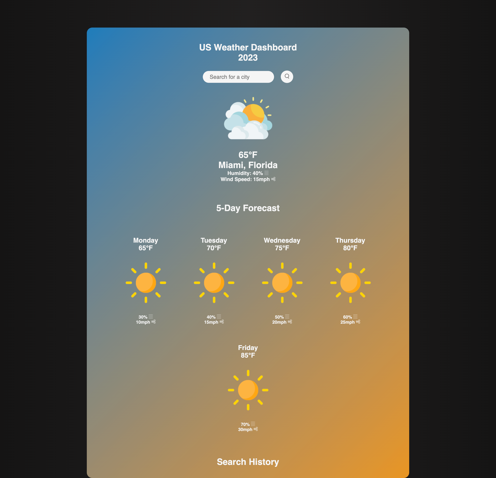
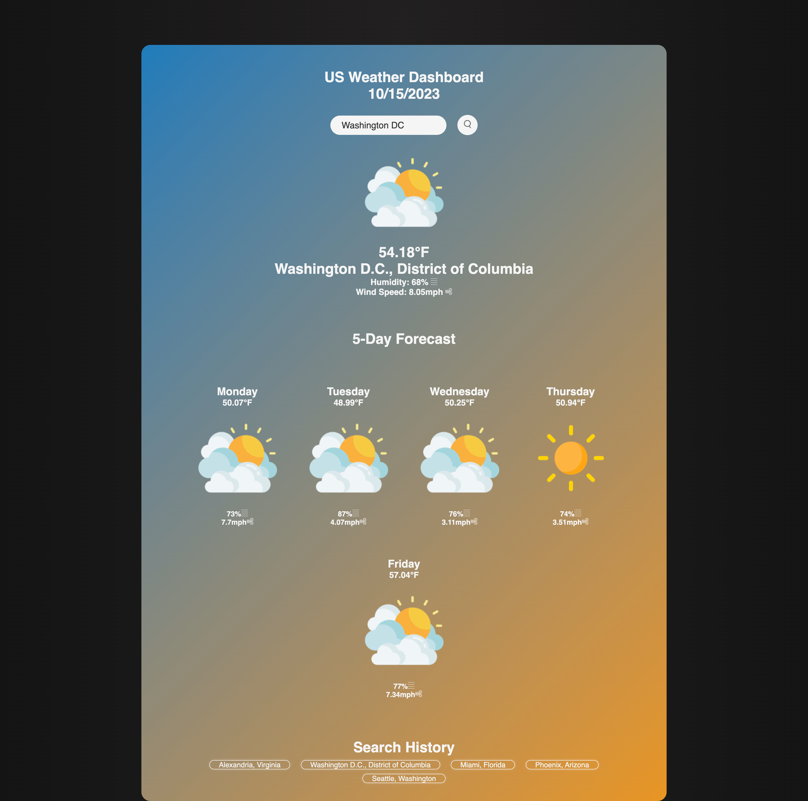

# [Weather Dashboard Project](https://jmorante89.github.io/Weather-Dashboard-Project/)

  ## Table of Contents
  - [Description](#description📝)
  - [Installation](#installation💻)
  - [Usage](#usage👨‍💻)
  - [Features](#features🎁)
  - [Credits](#credits📣)
  - [Resources](#resources🛠️)
  - [License](#licenses🔍)

## Description📝
Introducing the sophisticated US Weather Dashboard that offers comprehensive weather information at your fingertips. This dashboard not only presents you with today's weather, including humidity and wind speeds, but also provides a five-day weather forecast, ensuring that you stay well-informed about the upcoming days. Moreover, it maintains a convenient search history of your last five queries, allowing you to track and review your previous searches with ease.

## Installation💻
The provided URL will redirect users to a user-friendly website, obviating the need for any user-initiated installations. This application supports most browsers.
- [Live Demo Link](https://jmorante89.github.io/Weather-Dashboard-Project/)

## Usage👨‍💻
### The homepage offers easy access to key features such as the US City Search form, a 5-Day forecast, and a 5-Day Search History. It also prominently displays today's weather conditions below the Search form, providing humidity and wind speed information for user convenience. 

### To start just click on the Search form and type the desired US city. Then click the search icon or press ENTER.

### The page will load Todays date and current weather, including the following 5 days in the forecast. Your search will automatically be saved below in the Search history.

### The most recent 5 US city searches will be saved on the bottom of the screen even if you reload the

## Features🎁
    -Easy UI to find a US city 6 day forecast.  
    -Application shows temperature, humidity and windspeed in an easy to read format.  
    -The search history feature provides users with the convenience of not having to recall their previous search queries.

 ## Credits📣
- Daniel Morante 
  [Github Profile JMorante89](https://github.com/JMorante89)

## Resources🛠️
- [The Coding Bootcamp, starter code](https://github.com/coding-boot-camp/crispy-octo-meme)
- GWU tutoring
- [Google Font](https://fonts.google.com/specimen/Open+Sans)
- The project made use of the following APIs to aid in its development:
  - [jQuery](https://jquery.com/)
  - [Bootstrap](https://getbootstrap.com/)
  - [Day.js](https://day.js.org/)

## Licenses🔍
   